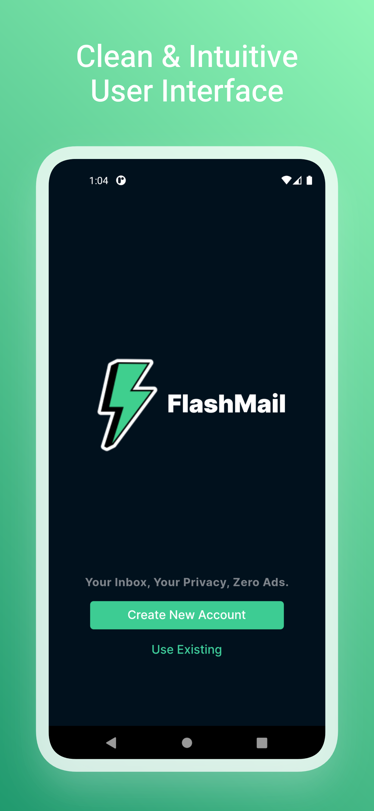
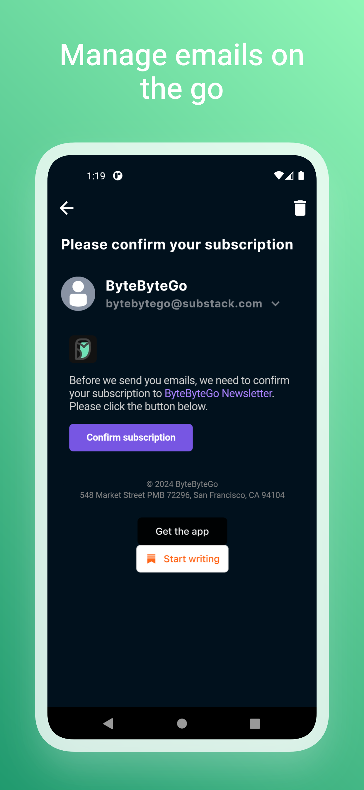
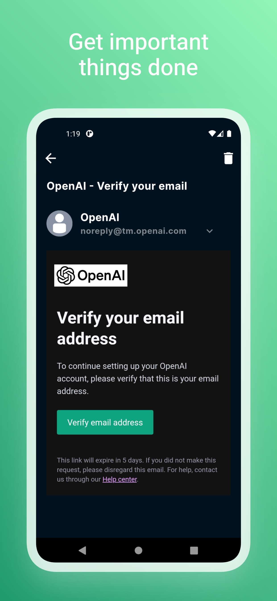

# FlashMail

FlashMail is a Mobile application designed to provide users with a temporary email solution powered by the mail.tm platform. With FlashMail, users can receive and view emails conveniently while maintaining their privacy. The app utilizes Riverpod as its state management solution for efficient and organized data handling.

This repository contains the source code for FlashMail developed using the Flutter framework. The app is designed to provide various features and functionalities to enhance user experience. Below, you will find information about how to download the app, its features, dependencies, license, and more.

## Download

You can download the latest version of the app from the [GitHub Releases](https://github.com/sarthakkimtani/flash-mail/releases) page. Look for the most recent release and download the corresponding APK or installer file for your device.

## Requirements

- Any Operating System (ie. MacOS X, Linux, Windows)
- Any IDE with Flutter SDK installed (ie. IntelliJ, Android Studio, VSCode, etc)
- A little knowledge of Dart and Flutter

## Features

- Instantly create temporary email addresses to receive messages without revealing your personal email.
- Enjoy a seamless user experience with an intuitive and user-friendly interface, making it easy to navigate through your emails effortlessly.
- Access and download attachments with ease, allowing you to view and save important files directly from your emails.
- Access and read your emails effortlessly with a seamless viewing experience.
- Benefit from a compact APK size of just 22 MB, ensuring that FlashMail takes up minimal storage space on your device.

## Screenshots

  


## Installation

To run the app locally and make modifications, follow these steps:

1.  Ensure you have Flutter SDK installed on your machine. You can download it from the official Flutter website: https://flutter.dev.
2.  Clone this repository to your local machine using the following command:<br>
    ```bash
    git clone https://github.com/sarthakkimtani/flash-mail.git
    ```
3.  Navigate to the project directory:<br><br>
    ```bash
    cd flash-mail
    ```
4.  Fetch the app's dependencies by running the following command:<br>
    ```bash
    flutter pub get
    ```
5.  Connect your device or start an emulator.
6.  Run the app using the following command:<br>
    ```bash
    flutter run
    ```

## Dependencies

| Name                                                                      | Usage                       |
| ------------------------------------------------------------------------- | --------------------------- |
| [**Auto Route**](https://pub.dev/packages/auto_route)                     | Navigation & Routing        |
| [**Dio**](https://pub.dev/packages/dio)                                   | HTTP Requests               |
| [**External Path**](https://pub.dev/packages/external_path)               | External Storage Path       |
| [**Flash**](https://pub.dev/packages/flash)                               | Alerts & Dialogs            |
| [**Flutter Downloader**](https://pub.dev/packages/flutter_downloader)     | Download Files              |
| [**Flutter InAppWebView**](https://pub.dev/packages/flutter_inappwebview) | In-App WebView              |
| [**Flutter Riverpod**](https://pub.dev/packages/flutter_riverpod)         | Global State Management     |
| [**Freezed**](https://pub.dev/packages/freezed)                           | Code Generation             |
| [**Hive**](https://pub.dev/packages/hive)                                 | Local Database              |
| [**Intl**](https://pub.dev/packages/intl)                                 | Internationalization        |
| [**Shimmer**](https://pub.dev/packages/shimmer)                           | Shimmer for Loading Screens |
| [**URL Launcher**](https://pub.dev/packages/url_launcher)                 | URL Launcher                |

## Contributing

Contributions to this app are welcome! If you find any issues or have ideas for improvements, please open an issue or submit a pull request. Make sure to follow the repository's guidelines for contributing.

## License

This app is distributed under the [MIT License](https://github.com/sarthakkimtani/flash-mail/blob/main/LICENSE). Feel free to modify and use it as per your requirements.

## Disclaimer

FlashMail is an independent project and is not affiliated with or endorsed by the mail.tm platform. Please review and comply with the terms of service of mail.tm when using this application.
